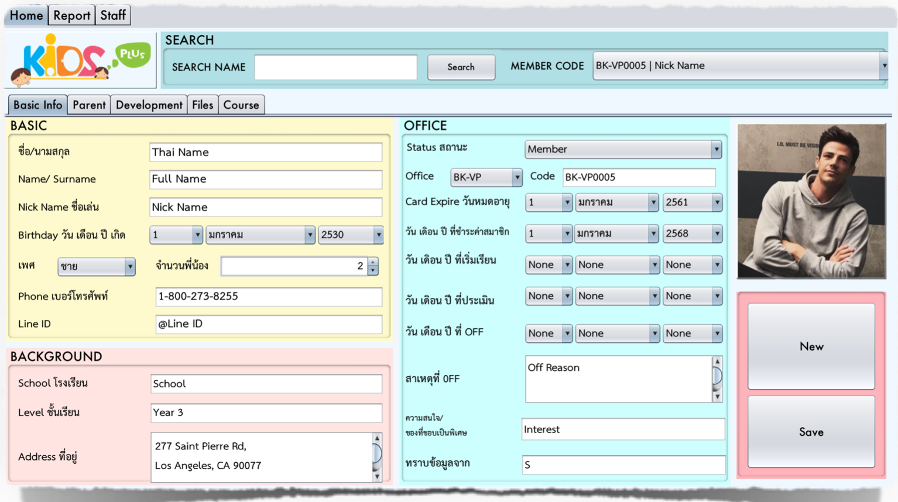
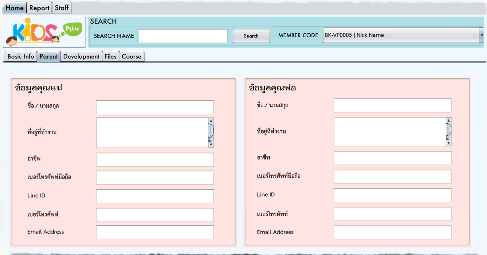
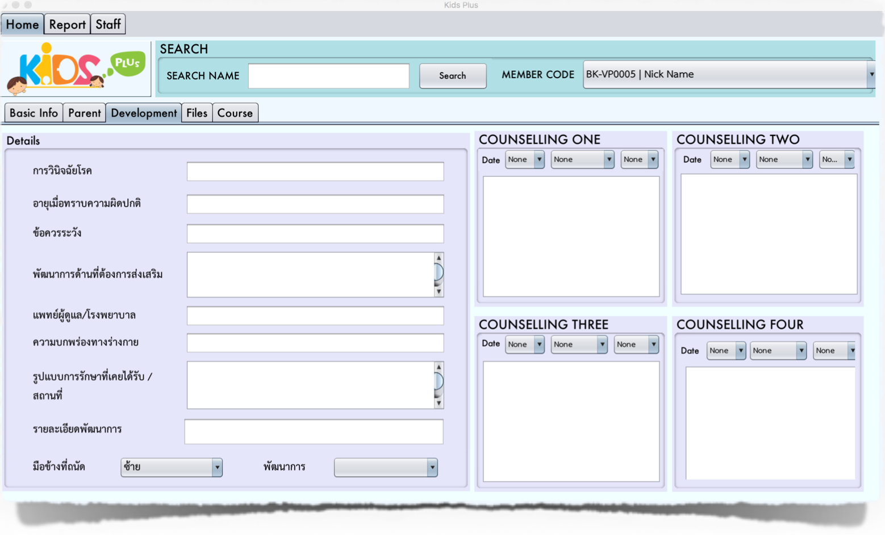
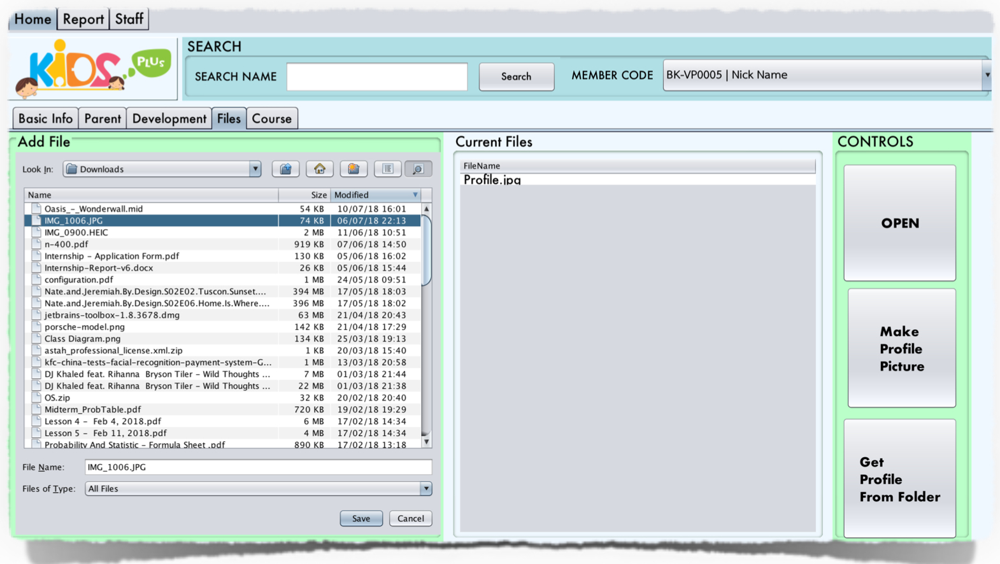
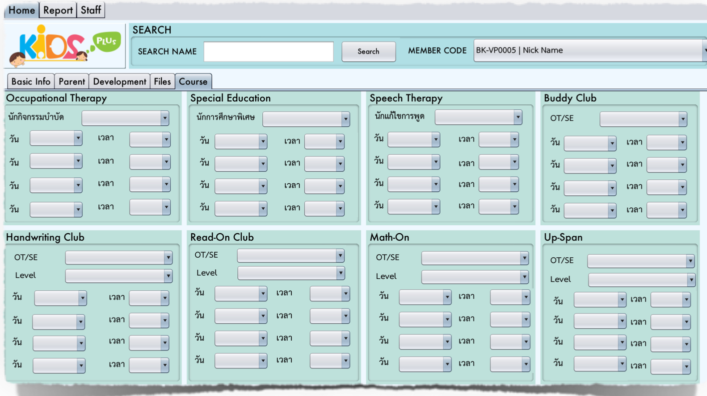
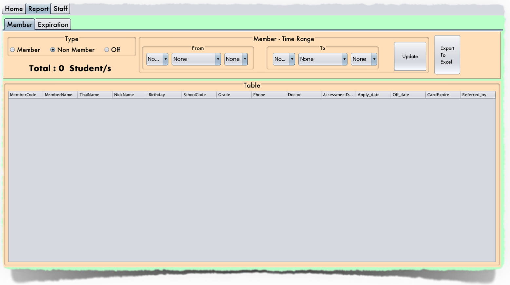
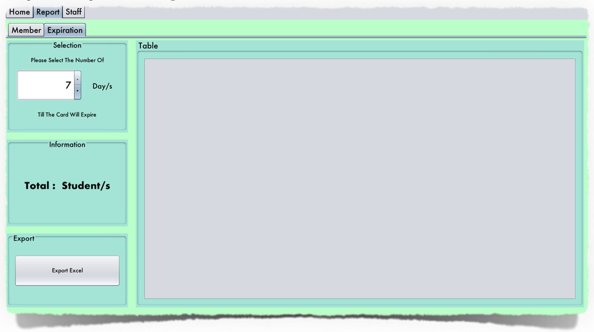
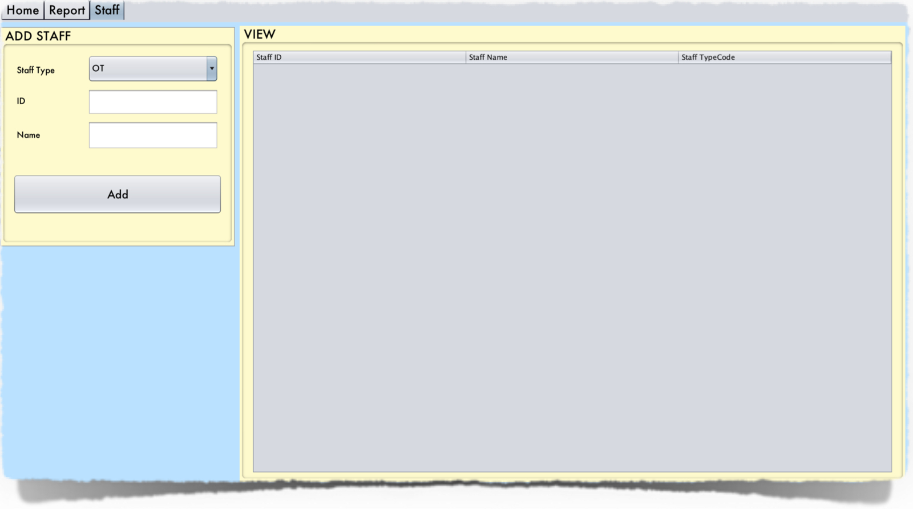
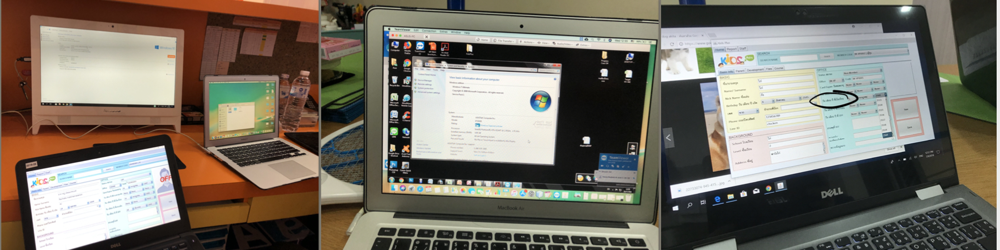

# Student-Management-System
The student management systems designed to replace the existing version which was in use for a long time, since then the business has grown and the system has failed to keep up with the needs. Thus, a new system was developed with an improved user interface, faster response time, new data points and analytical features. As well as the task of developing the system, I was in charge of deployment which involved onsite installation and conducting training sessions with the staff of 5 branches in Bangkok. As for the 2 branches in Chiang-Mai the sessions was conducted through remote technology. During this time, I was in close contact with the users, to provide technical support as well as adding new features.

## Home - Basic Info Page

## Home - Parent Page

## Home - Development Page

## Home - Files Page

## Home - Course Page

## Report - Member Page

## Report - Expiration Page

## Staff - Staff Page

## Testing 
The program was tested by the developer (myself) first by filling in information of some fictional character, making sure that the data was save and display correctly. Subsequently, the program was tested by a third party in order to ensure that the program is tested without biased and best represent the perspective of the actual user. Following that, the program was tested as a beta version to only one branch for a few weeks in order to receive feedback from the user during real world situations.

